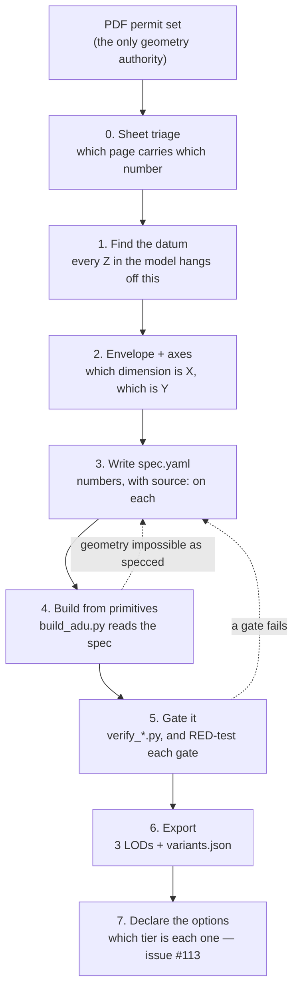
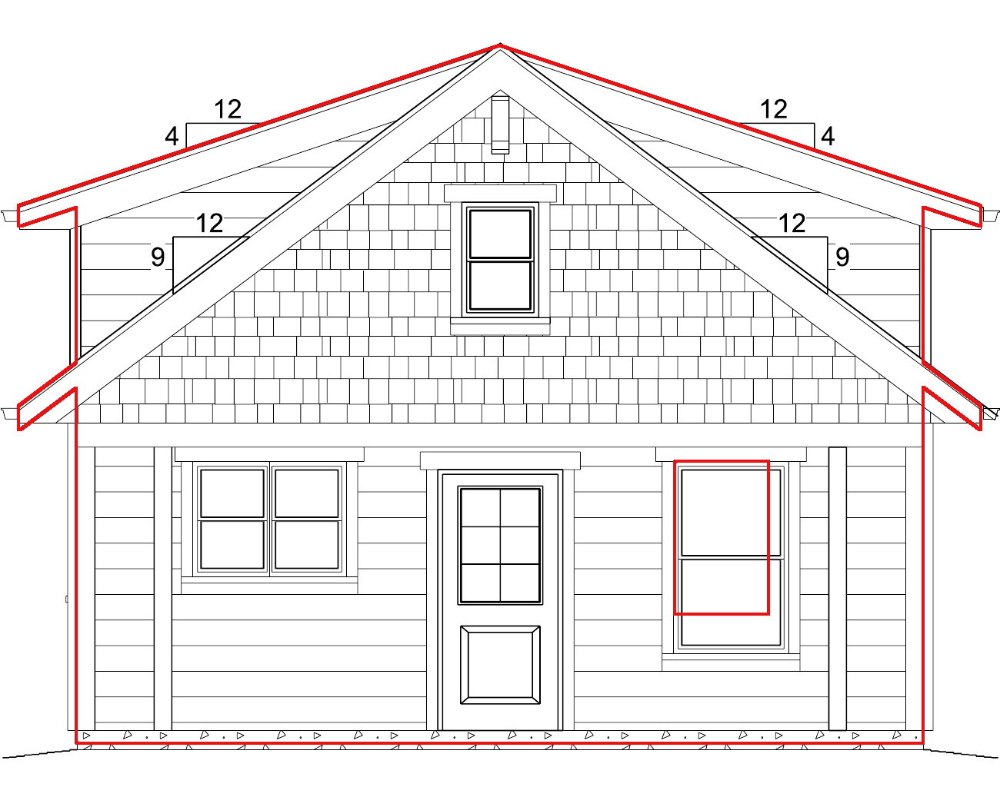
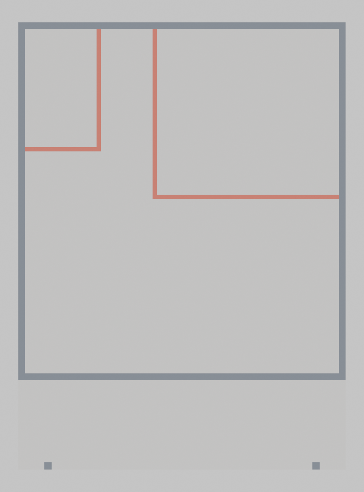
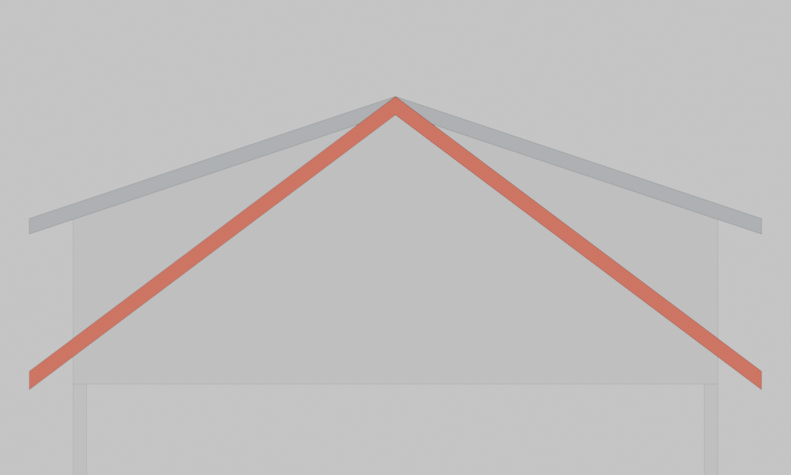
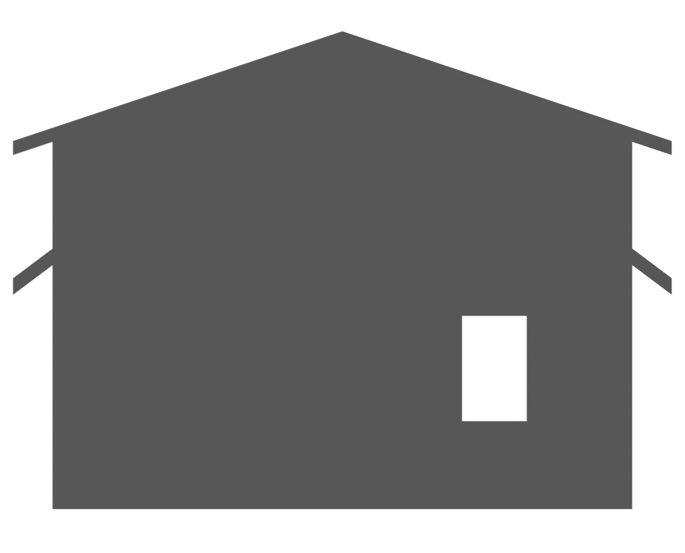

# Adapting an architectural plan set to a 3D model

**Audience:** whoever builds model two. You have a PDF permit set and you need
a `.glb` a configurator page can load, plus the gates that keep it honest.

This is the procedure that produced `barn_cabin_524` from a seven-page plan
set, written down after the fact — including the places it went wrong, because
those are the parts you would otherwise repeat. Every illustration here is a
real artefact from that model, not a mock-up.

**What you are adapting from** (`buyer/3D/example plans/`):

| set | sheets | what it is |
|---|---|---|
| `concord_plans` | 6 PDFs | six pre-approved ADU plans, 2025 CRC |
| `richmond_plans` | 1 PDF | a 1-bed bungalow permit set |
| `sacramento_adus` | 2 PDFs + 2 JPGs | A1 "Laurel" 460 sf, A2 "Willow" — **with renderings** |

`barn_cabin_524` came from `thataduguy` and also had a walkthrough video.
Sacramento's renderings are the same kind of evidence and carry the same
rule — see [Stage 2](#stage-2--separate-authority-from-evidence).

---

## The shape of the whole job



The dashed arrows are the normal case. You will go back to the spec many times,
and that is the pipeline working: **the spec is the artefact, the mesh is
output.**

---

## Stage 0 — Triage the sheets before you model anything

Do not open Blender. Open the PDF and write down what each page is, because you
will cite it a few hundred times and because **the drawing index lies**.

`barn_cabin_524`'s set declares eight sheets and contains seven:

```yaml
sheet_index:
  # NOTE: the PDF has 7 pages but the drawing index on A0.0 lists 8 sheets.
  # Sheet 2 (A0.1 SITE PLAN) is absent from this file. It carries no building
  # geometry, so it does not block the model.
  sheets:
  - {pdf_page: 1, sheet: "1 of 8", id: A0.0, title: "Cover / planning summary / front elevation"}
  - {pdf_page: 2, sheet: "3 of 8", id: A1.0, title: "Floor plans + elevations — OPTION A"}
  - {pdf_page: 3, sheet: "4 of 8", id: A1.1, title: "Floor plans + elevations — OPTION B"}
  ...
  missing_sheets:
  - {sheet: "2 of 8", id: A0.1, title: "Site plan", impact: none_for_geometry}
```

Note the shape of that: **`pdf_page` and `sheet` are different numbers.** Cite
the sheet id (`A1.1`), because that is stable, but record the page so the next
person can find it.

And note `impact: none_for_geometry`. A missing sheet is only a blocker if it
carries a number you need. Say which it is. The missing site plan later became
a *named assumption* rather than a guess:

```yaml
  compass:
    statement: "Porch/front assumed to face south; N/E/W assigned accordingly."
    reasoning: "The site plan (A0.1) is missing from the PDF, so true orientation
      is unknown. Wall IDs are self-consistent; remap if the site plan surfaces."
```

**If the set contains two complete variants, choose one and write down why.**
This set had a non-dormered Option A and a dormered Option B on consecutive
sheets. Picking silently would have left a model nobody could explain:

```yaml
option_selection:
  chosen: B
  reason: >
    ... The video tours the DORMERED unit: at 6:08 the narrator contrasts it
    with "the non-dormered barn cabin ... that carries the 9:12 all the way
    across" ...
  source: A1.0 vs A1.1; video 6:08-6:22
```

Concord has six plans. Each is its own model, not six options on one — see
[Stage 7](#stage-7--say-which-tier-each-option-is).

---

## Stage 1 — Find the datum, and prove it

**This is the single highest-risk number in the job and it is almost never
labelled.** Every vertical dimension you place depends on knowing what "height
of roof" was measured *from*.

```
        ┌──────── ridge ─────────┐   ← "H.T. OF (N) ROOF: 17'-9 11/16""
       ╱ ╲                                    …measured from WHAT?
      ╱   ╲
     ╱     ╲
    ├───────┤  ← top of plate    8'-0"   (this one IS labelled)
    │       │
    │       │
════╧═══════╧════  MAIN FINISHED FLOOR   0'-0"   ← candidate A
         ░░░░░░░
    ~~~~~~~~~~~~~  GRADE                         ← candidate B
```

We got this **wrong first, with a plausible argument**. Framing arithmetic
bottom-up gives 8'-0" plate + 9" heel + 9:12 over the 11'-0" half-span =
17'-0", leaving a 9-11/16" remainder that looks exactly like a stemwall reveal
from grade. So P1 recorded grade. Everything vertical in the model was 9-11/16"
out.

**What settled it was an independent witness, not a better argument.** Overlay
the model on the sheet's own elevation at a known scale and measure a feature
the two readings disagree about:



```yaml
    note: >
      Overlaying the model on the A1.1 front elevation at 50 px/ft settles it
      independently: the 4:12 dormer plane, projected from the ridge down to
      the wall line, lands at 17.807 - 4/12 x 11'-0" = 14.140 ft, and the
      sheet's own silhouette measures 14.16 ft there — a 0.24" agreement.
      That relationship only holds if 17'-9 11/16" is measured from the
      FINISHED FLOOR.
```

A 0.24" agreement on one reading and a 9-11/16" miss on the other is not a
judgement call. **Pick a feature whose position differs under the two readings,
and measure it.**

Two lessons that cost us real time:

- **Grade is not modelled at all.** The model's Z origin is the main finished
  floor and placement owns the grade-to-floor offset. Deciding that early
  removes a whole class of question.
- **A correction has to be applied everywhere the old reading was written.**
  The `assumptions:` block went on asserting grade *in the same file* that
  recorded the correction, so the fixed error got re-adopted from the other
  copy. When you settle a datum, grep for it.

---

## Stage 2 — Separate authority from evidence

Write this at the top of the spec, before any number:

```yaml
# AUTHORITY RULE: the PDF is the only geometry authority. Video frames may flag a
# discrepancy (see `discrepancies:`) but never override a plan dimension.
```

Sacramento ships renderings. They are the same category as our video: **they
tell you what the building looks like, never how big it is.** Hue is reliable.
Luminance is the renderer's lighting choice. A dimension scaled off a rendering
is a dimension you invented.

When the two disagree, **that is a finding, and it gets recorded rather than
split.** The `discrepancies:` block has four required fields, and the fourth is
the one people skip:

```yaml
discrepancies:
  - id: ladder-trim-board-cannot-sit-at-the-top-of-the-wall
    impact: >          # what differs, in numbers
      In the footage the flange board is at the TOP OF THE WALL ... In this
      model it has to hang from the loft floor surface instead, 9 3/4" higher.
      The reason is not the board and not the hardware: it is that THIS MODEL'S
      LOFT FLOOR OVERHANGS THE WALL BENEATH IT BY 1 3/4" ...
    resolution: >      # what you did, and why it is the honest choice
      MODEL WHAT THIS BUILDING IS. ... inventing a bracket to put the board
      where the video puts it would be modelling a fiction to match a frame.
    what_would_settle_it: >    # the question for a human with the real set
      Whether the loft floor is MEANT to overhang the bedroom wall by 1 3/4".
      A1.1 does not dimension that junction at the resolution read.
    not_done_here: >   # the change you deliberately did NOT make
      Moving the partition. It carries the bedroom door, the closet, the bypass
      gates and the loft above it ...
```

`what_would_settle_it` is the whole point of the block. A discrepancy without
it is a shrug; with it, it is a question somebody can answer in one email.

---

## Stage 3 — Envelope and axes

Get the footprint and **nail the axis convention down in writing**, because
every later mistake in this category is invisible.

```
                        NORTH  (back)
              ┌──────────────────────────────┐
              │                              │  ▲
              │      main body                │  │
              │      24'-0"  (Y / depth)      │  │  Y
              │                              │  │
              ├──────────────────────────────┤  │
              │   porch  6'-0"                │  │
              └──▲────────────────────────▲──┘  │
                 2'-0"      18'-0"     2'-0"
              ◄────── 22'-0" (X / width) ──────►
                        SOUTH  (front, porch)      ──► X

      total_footprint_depth = 24' + 6' = 30'
      bounding_box excludes the 18" eave overhangs
```

In the spec, every dimension carries its axis, its raw string, and its source:

```yaml
envelope:
  main_body_width:  {ft: 22.0, raw: "22'-0\"", axis: X, source: "A2.0 foundation plan, overall dim; A1.1 main floor plan"}
  main_body_depth:  {ft: 24.0, raw: "24'-0\"", axis: Y, source: "A2.0 foundation plan, overall dim; A1.1 main floor plan"}
  porch_depth:      {ft: 6.0,  raw: "6'-0\"",  axis: Y, source: "A2.0 foundation plan; A1.1 main floor plan"}
  porch_clear_between_posts: {ft: 18.0, raw: "18'-0\"", source: "A2.0 foundation plan (2'-0\" + 18'-0\" + 2'-0\" = 22'-0\")"}
```

Three conventions worth copying verbatim:

- **`ft:` is decimal feet, always.** One unit, declared once at the top of the
  file. Mixed units is how you get a 12× error nobody spots.
- **`raw:` keeps the sheet's own string.** When a reviewer asks "where did
  0.854 come from", `raw: "10 1/4\""` answers it instantly.
- **`source:` names the sheet, and names *two* when two agree.** A dimension
  confirmed on the foundation plan *and* the floor plan is a different quality
  of fact from one read off a single tag.

**Show your arithmetic when a number is derived from others**, the way
`porch_clear_between_posts` shows `2 + 18 + 2 = 22`. That is a free
cross-check on the overall dimension, and it caught real errors.

> **The eave/rake trap.** An 18" eave extends the **width** (X); an 18" rake
> extends the **depth** (Y). We had those swapped in the exported dimensions
> block and nothing caught it *because both overhangs are 18"*. Symmetry hides
> axis errors. If two numbers are equal, the gate that compares them proves
> nothing — pick a witness that distinguishes them.

---

## Stage 4 — Write the spec before you write geometry

The rule that makes the whole model maintainable:

> **No dimension, colour or position appears in `build_adu.py`.** It reads
> `spec.yaml`. If you are typing a number into the builder, you are in the
> wrong file.

`barn_cabin_524`'s spec is **3,236 lines** against a 2,618-line builder. That
ratio is correct and it should worry you if yours is inverted.

The top-level blocks, in the order they earn their place:

| block | what it holds |
|---|---|
| `meta`, `option_selection`, `sheet_index` | provenance — Stage 0 |
| `envelope`, `levels`, `foundation` | the box and the vertical stack — Stages 1–3 |
| `roof` | form, pitch, overhangs, dormers |
| `interior_partitions` | the walls inside |
| `openings`, `windows`, `doors` | holes, then what fills them |
| `exterior_finish`, `trim`, `construction` | cladding and detail |
| `fixtures` | plumbing, casework, appliances, furniture, lighting |
| `materials`, `textures`, `texturing` | the appearance layer |
| `variants`, `export`, `lod` | what the page is handed — Stage 6 |
| `areas_declared` | the sheet's own square footage, to check against |
| `discrepancies`, `assumptions` | everything you could not settle — Stage 2 |

**`areas_declared` is a cheap, powerful gate.** The sheet states a square
footage; your geometry can be measured. If they disagree, one of you is wrong
and it is usually you.

---

## Stage 5 — Build from primitives



`build_adu.py` provides a small vocabulary. **Reach for these before you reach
for a download** (ground rule 32 — a stacked assembly asked for a model and
turned out to be three boxes):

| primitive | for |
|---|---|
| `box`, `multibox` | walls, slabs, boards — most of the building |
| `prism_xz`, `prism_geom` | gables, anything with a profile extruded along an axis |
| `tube`, `multitube` | rails, rods, pipe |
| `loft`, `ellipse_ring`, `arc_points` | curved surfaces, basins |
| `clip_band` | a real recess — Sutherland–Hodgman polygon clip |
| `weld` | fuse parts into one mesh, for the object budget |
| `difference` | cut openings |
| `uv_project`, `mark_reveals` | UVs at a declared texel density |

Two hard constraints:

- **120 objects, and `lod0` is at 117.** `weld` is how you buy headroom. Plan
  for it; do not discover it at object 121. (Tracked as
  [#92](https://github.com/captproton/yardstake-ux/issues/92), and
  [#113](https://github.com/captproton/yardstake-ux/issues/113) changes the
  answer either way.)
- **Every exported mesh must be a closed solid wound outwards.** Not just
  closed — glTF culls by winding, so a sealed mesh wound inside out has its
  exterior culled and *vanishes*. Signed volume is the test. This is gated
  because we shipped all 28 materials `doubleSided` for the life of the model,
  purely because nobody set the Blender default.

**Name by prefix, because display modes key off names.** `Wall_`, `Roof_`,
`Gable_`, `Floor_`, `P_` for partitions. The page's SHOW INTERIOR mode is a
list of name prefixes to hide; a mesh named off-convention is a mesh that
cannot be hidden.

---

## Stage 6 — Gate it, then break the gates

Nine `verify_*.py` scripts, ~4,200 lines against a 2,618-line builder. That is
not over-engineering.

**Draw what the gate is arguing about.** A number in a log — "ridge plane
intercept 14.14 vs 14.16" — is hard to trust and harder to dispute. The same
disagreement rendered as two planes over the wall line is settled in a glance:



`render_elevations.py` is the tool, and its design is the point: orthographic
elevations at 200 dpi, where 1/4" = 1'-0" works out to **exactly 50.0 px/ft**
— the same scale the A1.1 sheet was rasterised at, so the output drops onto
the sheet with no resampling. That is what made the Stage 1 datum proof
possible. Build the equivalent for your set early; you will use it for the
datum, for every elevation check, and for every gate whose complaint is
easier to see than to read.

The scars, compressed. Read the full ground rules in
[`models/barn_cabin_524/docs/README.md`](../models/barn_cabin_524/docs/README.md)
— there are 42 and they are all paid for. The ones that will bite *you*:

**A gate must fail closed.** `if contract:` made the `lod2` contract skippable,
so a missing spec key silently disabled the guarantee. Worse: the same fix
revealed that `spec.get("export", {})` returns `None` for a key that exists and
is null. Write `(spec.get("export") or {})`.

**Run the gate before you write the file.** Ours ran *after* the export, so a
failing gate reported a failure on files already published.

**The witness cannot be the thing under test** (rule 40). A manifest gate that
read the manifest it was validating vouched for itself. Parse the exported
`.glb` instead.

**A gate that recomputes the build's arithmetic cannot disagree with it**
(rule 36). If the gate derives the expected value the same way the builder
derived the actual one, it tests nothing but your typing.

**RED-test every gate, and a lesion must break the build without telling the
gate** (rules 24, 35). Change the thing that makes the gate pass and confirm it
goes red. Three of my own lesions were worthless because I edited the *spec* —
which moves the gate's expectation along with the build. Lesion the **builder**.
And use file backups, never `git checkout`, in a lesion harness: that reverted
uncommitted work.

**Ask "is it usable", not only "is it legal"** (rule 37). Every gate passed
while a sofa blocked three-quarters of a 5-foot pocket door, because the
doorway gate tested door *leaves* — and a pocket door's leaves sit inside the
wall, beside the opening. **The door is not the doorway** (rule 38). Find
openings by walking the walls at two heights: a window is a hole too, but a
doorway goes to the floor.

**Some defects are only visible to a person.** The ladder sat 3.84" buried
inside the loft floor slab through a fully green suite. The user found it in a
render. When that happens, the fix is a gate *and* an entry in the ground
rules, or it recurs.

---

## Stage 7 — Export, and say which tier each option is

The export is three LODs plus a manifest. Real sizes, `barn_cabin_524`:

```
barn_cabin_524_lod0.glb   982,700 bytes   full detail, Draco compressed
barn_cabin_524_lod1.glb   239,456 bytes
barn_cabin_524_lod2.glb    30,108 bytes   UNTEXTURED — several instances on a phone
variants.json              12,141 bytes   what the page reads
```

Three things you owe the page:

1. **`variants.json`**, with `sets` (material options), `presence` (visibility
   options), `views` (display modes), `dimensions` (in feet), and `disclosure`
   (required UI copy). The page knows nothing about any building; everything it
   draws comes from here. **If the page contains your model's name, that is a
   defect.**
2. **A `lod2` node-name contract.** `lod2` is the placement developer's
   handoff and they address nodes by name. `spec.export.lod2_contract` lists
   24 names and the export fails if they change. When it *does* change,
   say so in the commit — a passing gate is not a changelog.
3. **Write everything through a staging directory and promote atomically.**
   We fixed artefact publication four times before doing this. Build into
   `export.staging/`, then `os.replace` each file.

Then declare your options against the three tiers
([#113](https://github.com/captproton/yardstake-ux/issues/113)) — and this is
where the reference implementation is genuinely instructive:

```
TIER 1  same geometry, different material     ←  one line of spec
        `sets`: baseColorFactor / texture swap
        THIS IS WHERE MOST OF "STYLE" BELONGS. Studio Home's siding,
        roofing, flooring, counters and cabinets are all texture swaps.

TIER 2  same geometry, different subset shown  ←  a spec block + re-export
        `presence` / `views`
        Ceiling: it can only reveal geometry you already built.

TIER 3  different geometry — and it forks:
   3a   a separate part over a declared seam    ←  one file per variant
        Studio Home composes ONLY the roof this way: its own mesh,
        `optional: true`, namespaced by square footage, not model name.
   3b   a whole body per combination, pre-baked ←  N files, N exports, N × 9 gates
        Larch ships 24 bodies: 2 bed counts × 3 interiors × 4 styles.
   3c   a continuous parameter ("move this wall two feet")
        NOT A PAGE FEATURE AT ALL. It is a spec edit and a rebuild —
        which is to say, this pipeline, just not in a browser.
```

**Put a new option in the lowest tier that can carry it.** The reference's
"four styles" sound like four buildings and are mostly tier 1 with a tier-3a
roof. Ours should be too.



---

## Worked example: starting Sacramento A1 "Laurel", 460 sf

Chosen deliberately because **it shares almost no typology with the barn
cabin**: single storey, slab on grade, no loft, no dormers, no porch. If the
pipeline is really spec-driven, that costs spec lines and not builder lines.

A concrete first day:

1. **Triage** `adu-plan-full-set-a1-laurel.pdf`. Write `sheet_index` with
   `pdf_page` *and* sheet id. Note anything missing and its `impact`.
2. **Datum.** Slab on grade means the finished-floor datum question is
   *easier*, not absent: find the slab thickness and whether the stated height
   is to FF or to top of slab. Prove it with an elevation overlay before you
   build anything vertical.
3. **Envelope and axes.** Draw the plan diagram like the one above, with the
   long axis labelled. Decide which way is front and record the compass
   assumption if the site plan is missing.
4. **`areas_declared: 460`**, from the sheet. Your first gate.
5. **Envelope-only build.** Walls, roof, slab, no openings. Check the footprint
   and the declared area. Stop there and look at it.
6. **Then openings, then finish, then fixtures** — the tier order that
   `barn_cabin_524`'s own docs follow
   ([TIER-1](../models/barn_cabin_524/docs/TIER-1-schematic-interior.md),
   [TIER-2](../models/barn_cabin_524/docs/TIER-2-materials-and-textures.md),
   [TIER-3](../models/barn_cabin_524/docs/TIER-3-fixtures-and-furnishing.md)).

**Expect the gates to need work, and expect that to be the finding.** Several
`barn_cabin_524` gates assume a loft or a porch exists. A gate aimed at a scene
that cannot contain its subject **passes vacuously** (rule 28) — which is
worse than failing, because it reports green. Laurel will find those, and each
one it finds is a gate that was never really testing this model either.

---

## Checklist

Before you call a model done:

- [ ] Every number in `spec.yaml` has a `source:` naming a sheet
- [ ] Every number that came from a rendering or video is in `discrepancies:` or `assumptions:`, not in a dimension
- [ ] Every `discrepancies:` entry has `what_would_settle_it`
- [ ] The datum is proved by an independent witness, and the proof is written down
- [ ] No dimension, colour or position appears in `build_adu.py`
- [ ] Geometry area agrees with `areas_declared`
- [ ] Object count is under 120
- [ ] Every exported mesh is closed **and wound outwards**
- [ ] Object names follow the display-mode prefixes
- [ ] Every gate has been RED-tested by lesioning the **builder**, not the spec
- [ ] Every gate fails closed, and runs before the write
- [ ] No gate reads the artefact it is validating
- [ ] `variants.json` validates, and the page needs no knowledge of this building
- [ ] A `lod2` node contract exists, and any change to it is in the commit message
- [ ] Every option is declared at the lowest tier that can carry it
- [ ] Ground rules updated with anything this model taught you

The last line is not ceremony. There are 42 rules because 42 things went wrong
once each. Adding the 43rd is how model three gets cheaper than model two.
